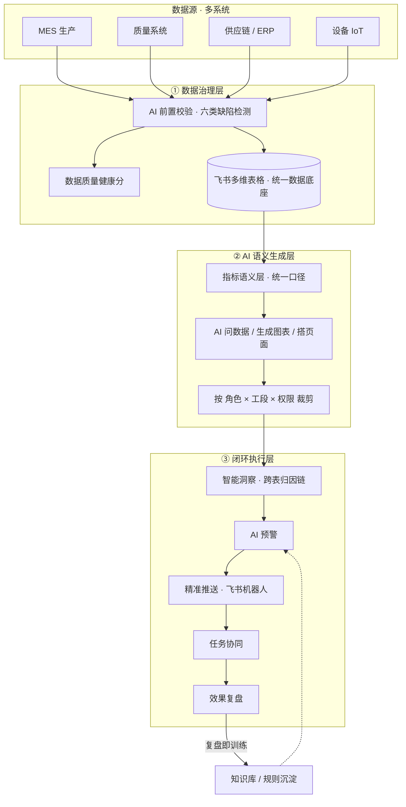

# 千人千面数据洞察闭环平台 · 飞书 AI 原生方案

> 2026 AI 先锋未来人才大赛参赛作品 ｜ 命题企业:歌尔股份
> 赛题:依托飞书 AI 原生能力,打造 AI 驱动千人千面数据洞察闭环方案

**核心主张:功能人人都有,我们把「闭环」做到了决策被追踪、效果被验证——闭环到效果验证,而非止于推送。**

---

## 🎯 方案一句话

面向精密制造场景,数据接入即完成 AI 质量体检;一线用自然语言描述需求,AI 零代码生成岗位专属看板,并自动跑通「智能洞察 → AI 预警 → 精准推送 → 任务协同 → 效果复盘」全链路闭环。全部基于飞书现成 AI 能力,低代码交付,可按 BG / 工厂快速复制。

## 🏗️ 整体架构



## ✨ 核心创新点

1. **动态角色感知的千人千面** —— 看板按时间与业务阶段自动切换重点,并主动送达,变"人找数"为"数找人"。
2. **跨表自动归因链** —— 异动直指根因（良率↓ → 来料批次 → 设备参数漂移）。
3. **指标语义层统一口径** —— 内建指标字典,根治各部门数据业务脱节。
4. **数据前置体检** —— 入库前 AI 打健康分并路由责任人,不让坏数据进来。
5. **决策证据链 + 每周 AI 复盘** —— 看板即标记所支撑决策并追踪效果,闭环到效果验证。
6. **多 BG 分层联动** —— 集团 / BG / 工段按权限分层,契合多业务主体数据联动。

## 📁 目录结构

```
飞书Demo/
├── 00_材料索引_先看我.md        # 补充材料索引（评委先看这个）
├── README.md                    # 本文件
├── 飞书Demo搭建手册.md          # 逐步搭建操作手册 + 录屏分镜脚本
├── 答辩口播稿_90秒.md           # 演示口播稿
├── 参考资料清单.md              # 引用来源（均经核实）
├── 01_全球生产运营总表.csv      # 主表（含六类缺陷埋点）
├── 02_异常记录表.csv            # 喂 AI 字段捷径
├── 03_来料批次表.csv            # 跨表归因用
└── 04_预警任务表.csv            # 决策证据链 + 复盘
```

## 🚀 复现 Demo（约 50–60 分钟）

1. 新建飞书多维表格,按 `飞书Demo搭建手册.md` 第 1 步导入 4 个 CSV。
2. 按第 2 步在「异常记录表」配置 AI 字段捷径（分类 / 提取 / 总结）。
3. 按第 3 步用多维表格 Agent 生成 4 个角色看板。
4. 按第 5 步搭建自动化工作流,跑通「预警 → 推送 → 回写 → 二次验证」闭环。
5. 按第 7 步分镜录屏。

> 数据设计:潍坊 L2 的 FPY 在 07/15 骤降 → 归因到来料批次 B20260714-03 → 07/17 回升,一条线走完完整闭环;六类数据缺陷分散埋在各行,用于演示"数据前置体检"。

## 👥 团队能力

团队具备飞书开放平台实战经验,已实现「业务系统事件 → 飞书机器人定向推送」链路,可直接迁移至产线预警场景。

## 📚 参考资料

见 `参考资料清单.md`。关键数据:罗克韦尔《State of Smart Manufacturing》报告——制造企业仅约 44% 的已采集数据被有效利用。

## ⚠️ 声明

本仓库数据均为**模拟数据**,用于方案演示,不涉及任何企业真实生产数据。
